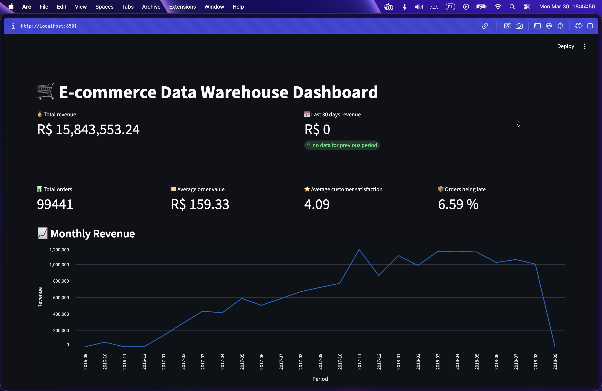
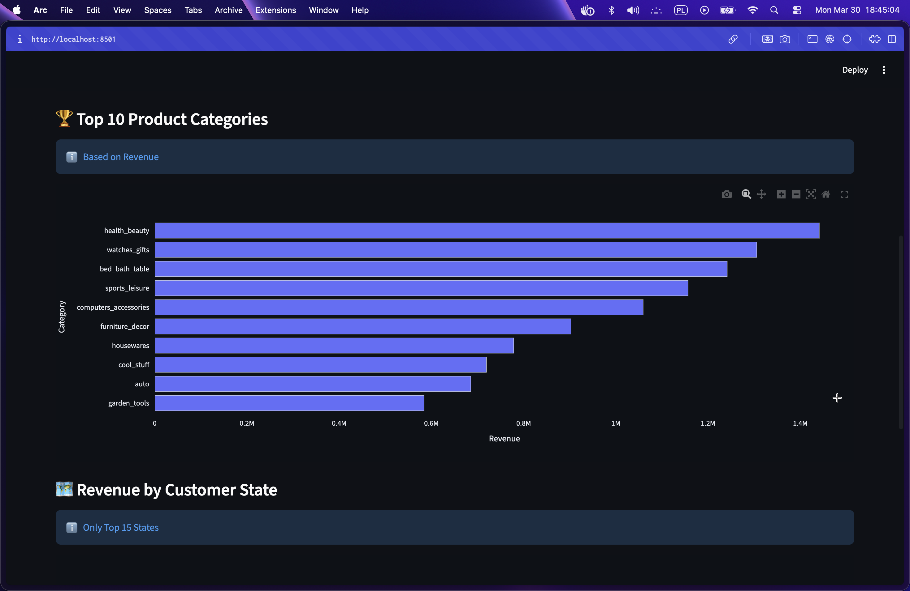
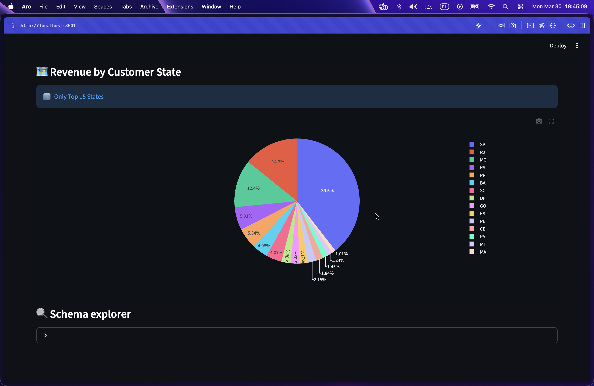
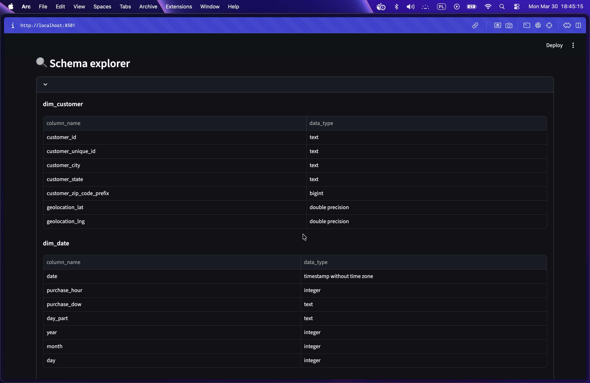
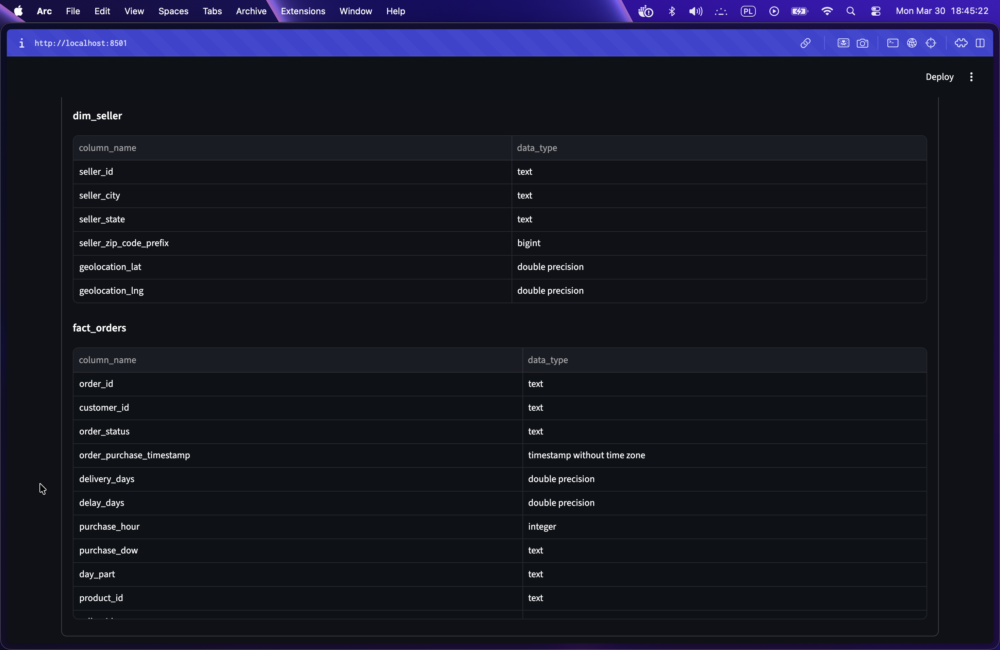

# E-commerce Data Warehouse 🛒📊

End-to-end **ETL pipeline** with a **Star Schema Data Warehouse** for Brazilian E-commerce data analysis.

<p align="center">
  
</p>

## 🛠️ Tech Stack

| Category | Technology |
|----------|------------|
| **Language** | Python 3.14 |
| **Data Processing** | Pandas, NumPy |
| **Database** | PostgreSQL 17 (Docker) |
| **ORM** | SQLAlchemy, psycopg2 |
| **Data Source** | Kaggle API (kagglehub) |
| **Dashboard** | Streamlit, Plotly |
| **DevOps** | Docker Compose |

## 🚀 Quick Start

### Prerequisites
- Python 3.10+
- Docker & Docker Compose
- Kaggle account (API key may not be required for public datasets)

### Installation

```bash
# 1. Clone & setup
git clone https://github.com/yourusername/E-commerce-Data-Warehouse.git
cd E-commerce-Data-Warehouse

# 2. Virtual environment
python -m venv .venv
source .venv/bin/activate  # Linux/macOS
# .venv\Scripts\activate   # Windows

# 3. Install dependencies
pip install -r requirements.txt

# 4. Configure .env (optional - for Kaggle API)
echo 'KAGGLE_KEY=your_api_key' > .env

# 5. Start database
docker-compose up -d
```

### Usage

```bash
# Run ETL pipeline
cd src && python pipeline.py

# Start dashboard (http://localhost:8501)
streamlit run ./src/dashboard.py
```

## 🏗️ Architecture

```
Kaggle ──▶ Extract ──▶ Transform ──▶ Load ──▶ PostgreSQL ──▶ Streamlit
           (CSV)      (Pandas)      (SQL)                   Dashboard
```

### ETL Pipeline

| Step | File | Description |
|------|------|-------------|
| **Extract** | `extract.py` | Downloads 9 CSV files from Kaggle, auto-retry if missing |
| **Transform** | `transform.py` | Data cleaning, feature engineering, star schema modeling |
| **Load** | `load.py` | Bulk insert to PostgreSQL (chunked, 1000 rows) |
| **Orchestration** | `pipeline.py` | Runs full ETL cycle with logging |

### Feature Engineering
- `delivery_days`, `delay_days` – delivery performance
- `purchase_hour`, `purchase_dow`, `day_part` – time features
- `revenue` – price + freight
- `sentiment` – review classification (negative/neutral/positive)

## 📁 Project Structure

```
├── src/
│   ├── extract.py, transform.py, load.py   # ETL modules
│   ├── pipeline.py                          # Orchestration
│   ├── dashboard.py                         # Streamlit app
│   └── logger.py                            # Logging config
├── data/raw/                                # Kaggle CSV files
├── logs/                                    # ETL logs (etl_YYYYMMDD.log)
├── docs/                                    # Screenshots
├── docker-compose.yml                       # PostgreSQL setup
└── requirements.txt
```

## 📊 Dashboard

<p align="center">
  
</p>

<p align="center">
  
</p>

<p align="center">
  
</p>

<p align="center">
  
</p>

**Features:** KPIs (revenue, orders, avg order value, satisfaction) • Monthly revenue chart • Top 10 categories • Revenue by state • Schema explorer

## 📚 Data Source

[Olist Brazilian E-commerce Dataset](https://www.kaggle.com/datasets/olistbr/brazilian-ecommerce) – ~100k orders (2016-2018)

---

## ⭐ Star Schema (OLAP)

<details>
<summary><b>Click to expand table schemas</b></summary>

### `fact_orders`
| order_id | customer_id | order_status | order_purchase_timestamp | product_id | seller_id | price | freight_value | revenue | total_payment | payment_installments | payment_type | delivery_days | delay_days |
|---|---|---|---|---|---|---:|---:|---:|---:|---:|---|---:|---:|
| e481f51cbdc54678b7cc49136f2d6af7 | 9ef432eb6251297304e76186b10a928d | delivered | 2017-10-02 10:56:33 | 87285b34884572647811a353c7ac498a | 3504c0cb71d7fa48d967e0e4c94d59d9 | 29.99 | 8.72 | 38.71 | 38.71 | 1 | credit_card | 8 | -8 |
| 53cdb2fc8bc7dce0b6741e2150273451 | b0830fb4747a6c6d20dea0b8c802d7ef | delivered | 2018-07-24 20:41:37 | 595fac2a385ac33a80bd5114aec74eb8 | 289cdb325fb7e7f891c38608bf9e0962 | 118.70 | 22.76 | 141.46 | 141.46 | 1 | boleto | 13 | -6 |

### `dim_customer`
| customer_id | customer_unique_id | customer_city | customer_state | customer_zip_code_prefix | geolocation_lat | geolocation_lng |
|---|---|---|---|---:|---:|---:|
| 06b8999e2fba1a1fbc88172c00ba8bc7 | 861eff4711a542e4b93843c6dd7febb0 | franca | SP | 14409 | -20.498489 | -47.396929 |
| 18955e83d337fd6b2def6b18a428ac77 | 290c77bc529b7ac935b93aa66c333dc3 | sao bernardo do campo | SP | 9790 | -23.727992 | -46.542848 |

### `dim_product`
| product_id | category_en | product_weight_g | product_length_cm | product_height_cm | product_width_cm | product_photos_qty |
|---|---|---:|---:|---:|---:|---:|
| 1e9e8ef04dbcff4541ed26657ea517e5 | perfumery | 225 | 16 | 10 | 14 | 1 |
| 3aa071139cb16b67ca9e5dea641aaa2f | art | 1000 | 30 | 18 | 20 | 1 |

### `dim_seller`
| seller_id | seller_city | seller_state | seller_zip_code_prefix | geolocation_lat | geolocation_lng |
|---|---|---|---:|---:|---:|
| 3442f8959a84dea7ee197c632cb2df15 | campinas | SP | 13023 | -22.893848 | -47.061337 |
| d1b65fc7debc3361ea86b5f14c68d2e2 | mogi guacu | SP | 13844 | -22.383437 | -46.947927 |

### `dim_date`
| date | purchase_hour | purchase_dow | day_part | year | month | day |
|---|---:|---|---|---:|---:|---:|
| 2017-10-02 10:56:33 | 10 | Monday | morning | 2017 | 10 | 2 |
| 2018-07-24 20:41:37 | 20 | Tuesday | evening | 2018 | 7 | 24 |

### `dim_review`
| review_id | order_id | review_score | sentiment | response_time_days |
|---|---|---:|---|---:|
| 7bc2406110b926393aa56f80a40eba40 | 73fc7af87114b39712e6da79b0a377eb | 4 | positive | 0 |
| 80e641a11e56f04c1ad469d5645fdfde | a548910a1c6147796b98fdf73dbeba33 | 5 | positive | 1 |

</details>
